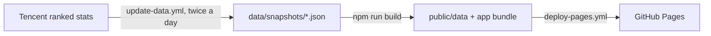

# Wild Rift Stats

Ranked champion win, pick and ban rates for League of Legends: Wild Rift, tracked over time.

**Live site: <https://timlindeijer.github.io/wildrift-stats/>**

The numbers come from Tencent's public ranked stats for the **China server**. Riot has no public Wild Rift API, and nobody publishes stats for ARAM or other modes, so the site covers **ranked games only**.

## What's on the site

- **Tier list**: every champion by rank bracket (All, Diamond+, Master+, Challenger+, Legendary) and role (Baron, Jungle, Mid, Duo, Support), with search and sortable tier, win, pick, ban and change columns.
- **Champions**: Tencent's official 1–3 ratings (difficulty, damage, toughness, utility) and base stats at level 1 or 15 for every champion, sortable and searchable.
- **Champion pages**: current numbers and changes; how often the champion is picked or banned, how its games split between roles and how its win rate in the chosen bracket compares with all ranks; win, pick and ban rate charts with dashed lines at patch releases; a matrix of every role and bracket; its ratings and base stats; and its passive, abilities and ultimate, with descriptions, cooldowns, costs and preview videos.
- **Compare**: up to six champions on one chart, by win rate, pick rate, ban rate or tier score.
- **Movers**: the biggest win-rate gains and drops over 1, 7 or 30 days, or since the current patch.
- **Insights**: the most contested champions (picked or banned in the most games), flex picks that play more than one role, and who does better or worse in high elo than across all ranks.
- **About**: the data source, units, and how tiers and insights work.

Filters are kept in the URL, so every view can be shared or bookmarked.

## How it works

Tencent's endpoint only returns the current day, so the history is built by [git scraping](https://simonwillison.net/2020/Oct/9/git-scraping/): a scheduled GitHub Action fetches the day's stats and commits them to this repository. The site is static. It reads the committed files and has no server or database.



1. `update-data.yml` runs at 02:41 and 14:41 UTC. Tencent publishes the previous day's stats at about 02:00 UTC; the second run is a safety net.
2. `scripts/fetch-stats.ts` fetches the stats, the champion list, each champion's file (base stats, ability cooldowns and costs) and each champion's page on the official Wild Rift site (ability names and descriptions), validates them and writes `data/snapshots/<date>.json`, `data/champions.json`, `data/base-stats.json` and `data/abilities.json`. The date is Tencent's stats date (`dtstatdate`), not the day of the run. Files are only written when their content changes, so a run with nothing new commits nothing. Base stats and abilities are best effort: a champion whose file or page fails to load keeps its previous values, and the run only warns. The run stops asking a source after 8 failures in a row or 4 minutes, so a blocked or stalled source can't hold up the stats.
3. When data changed, the job commits it as `github-actions[bot]` (`chore(data): add ranked snapshot YYYY-MM-DD`), rebasing before it pushes, and then calls `deploy-pages.yml` to build and deploy that commit. It has to call the deploy directly because pushes made with the workflow's `GITHUB_TOKEN` don't trigger `push` workflows.
4. `npm run build` first runs `scripts/build-data.ts`, which turns the snapshots into the small files the frontend loads, and then builds the app with Vite.

If the response changes shape (`result` isn't 0, the data is laid out differently, a value isn't a number, a rate falls outside 0–1, or there are far fewer rows than usual), the fetcher stops with a "Schema drift" error and commits nothing, so the site keeps showing the last good snapshot. Smaller surprises, such as a missing bracket or role or an unknown key, show up as warnings on the run and in its job summary.

## Data source

| What | Where |
| --- | --- |
| Ranked stats | `https://mlol.qt.qq.com/go/lgame_battle_info/hero_rank_list_v2` |
| Champion list (Chinese names, icons, lanes, ratings) | `https://game.gtimg.cn/images/lgamem/act/lrlib/js/heroList/hero_list.js` |
| Base stats and ability cooldowns and costs, one file per champion | `https://game.gtimg.cn/images/lgamem/act/lrlib/js/hero/<heroId>.js` |
| English names | Riot Data Dragon `champion.json` |
| Ability names, descriptions, icons and preview videos | Champion pages on the official Wild Rift site, `https://wildrift.leagueoflegends.com/en-us/champions/<slug>/` |

The stats arrive as `data[rank][lane] = rows`:

- Rank keys: `0` All ranks, `1` Diamond+, `2` Master+, `3` Challenger+, `4` Legendary.
- Lane keys: `1` Mid, `2` Baron, `3` Duo, `4` Support, `5` Jungle.

What the real data showed:

- The Legendary bracket (`4`) is present but empty. The site shows it as unavailable until Tencent fills it.
- A champion is only listed in a role when it's picked in about 1% or more of that role's games, so rare picks come and go.
- The listed pick rates in a role add up to about 170–190%. Both teams fill every role, so the full total would be 200%; champions below the listing cutoff account for the rest.
- The ban rate is per champion, so it's the same in every role.
- Values are strings, sometimes in scientific notation (`"9.75E-4"`).
- `strength` is Tencent's rank within the role (1 is best) and `strength_level` (0–5) splits that ranking into fixed-size groups that lean heavily on popularity. The site shows them as "CN tier" for reference and doesn't use them for its own tiers.
- The `*_bzc` fields (`win_bzc`, `appear_bzc`, `forbid_bzc`) aren't baselines: they're the champion's rank within the role by that rate. The `*_float` fields look like day-over-day changes in those ranks. The site stores neither, since it can rank by any rate itself and works out changes from its own history.
- The per-champion endpoint `hero_rank_data_v2` also returns only the current day, so earlier history **can't be backfilled**. `npm run probe:history`, or the `probe_history` workflow option, prints what it returns.

What the champion files showed:

- The champion list rates every champion from 1 to 3 in `difficultyL`, `damage`, `surviveL` and `assistL`. The site calls the last two toughness and utility.
- Each champion's file has its level 1 stats and their growth per level as separate fields (`hp` and `hpperlevel`, and so on), stored ×10,000 (move speed ×100). Regeneration is per 5 seconds. Champions without mana (23 of 142 in October 2026) report 0, which the site stores as `null`.
- Level-ups are scaled by multipliers that rise from 0.74 at level 2 to 1.26 at level 15 and average 1, so a stat at level 15 is its level 1 value plus 14 times the per-level value. Tencent doesn't document this; it's inferred from the data.
- Each file lists five `spells`: the passive, three abilities and the ultimate. Each has a Chinese name and description and the values its tooltip compares when the ability ranks up, as `variTypeN` and `variValueN` pairs: `cd` → `9/8/8/7` for the cooldown, the cost under the name of its `costtype`, and Chinese-labelled values such as `基础伤害` (base damage) → `40/80/120/160`. `cdtime` and `costvalue` only hold the first rank. The site shows the cooldowns and costs. The other values use about 170 different labels, many specific to one champion, so they aren't translated or shown yet.
- The cost types are mana, health, a percentage of health and `Resource`, which covers energy, fury and other champion-specific resources.
- The files also hold attack speed and a critical strike value, which the site doesn't show. They have no attack range.

What the official site showed:

- The champion pages are a Next.js app that embeds its content as JSON (`__NEXT_DATA__`, also served at `/_next/data/<buildId>/en-us/champions/<slug>.json`). The fetcher reads the champion list for each page's address and then the abilities block of each page. If a data URL fails, it falls back to the HTML page.
- In October 2026 the site had a page for all 142 champions in Tencent's list. A champion it doesn't list yet keeps Tencent's Chinese ability names, and the run warns about it.
- The descriptions explain what an ability does but leave most numbers out. Ability names are inconsistently capitalised, so the site shows them in capitals.
- Icons and preview videos are linked from Riot's CDN, not copied.

English names come from each champion's poster file name (`.../Posters/Garen_0.jpg` gives `Garen`), matched case-insensitively against Data Dragon ids (`MonkeyKing` is Wukong). Champions Data Dragon doesn't know, such as the Wild Rift–only Norra, use `NAME_OVERRIDES` in `scripts/lib/champions.ts`, and anything left over falls back to splitting the CamelCase key. The fetcher warns in the job summary about every champion without a confident name. If Data Dragon is unreachable, it keeps the names it resolved before.

### Units

All rates are stored as **percentages with two decimals**: `51.23` means 51.23%. Changes (Δ) are differences in **percentage points**.

### Limitations

- **China server only.** Balance, patch timing and the meta can differ in other regions.
- **Ranked only.** There's no public source for ARAM or other modes.
- **History starts on 2026-10-04**, the first day the job ran, and can't be backfilled. Trend charts appear once a role and bracket has three daily snapshots.
- **Legendary has no data** in Tencent's responses so far.
- **No builds, items, runes, KDA, matchups, synergies or stats by game length** (early vs late game). None of them are in Tencent's public data, and there's no other public source for Wild Rift.
- **Ability cooldowns and costs are China-server values** and can differ on other servers. Damage, scaling and other values by rank aren't shown yet.
- **Tencent can change or remove the endpoint** at any time. The update job then fails loudly, and the site keeps the last good data.
- Patch dates are maintained by hand (see [Adding a patch](#adding-a-patch)).

## Tiers

The site computes its own tiers for each role and bracket from each day's snapshot:

```text
score = 100 × (0.60 × win percentile + 0.25 × pick percentile + 0.15 × ban percentile)
```

A percentile runs from 0 (lowest in the role) to 1 (highest), and ties share their average rank. The score sets the tier:

| Tier | Score |
| --- | --- |
| S+ | 80 or more |
| S | 65 to under 80 |
| A | 50 to under 65 |
| B | 35 to under 50 |
| C | 20 to under 35 |
| D | under 20 |

The weights and thresholds are in `src/shared/tiers.ts`. Because the score is relative, a tier says how a champion ranks in its role that day, not whether it wins more than half its games.

## Insights

The Insights page and the champion pages work these out from the latest snapshot (`src/lib/insights.ts`):

- **Picked or banned**: a champion's pick rates in all its listed roles plus its ban rate. Ranked uses draft pick, so a champion is in a game at most once, and the sum is the share of games in which it was picked or banned. Tencent lists a role only once its pick rate reaches about 1%, so this can be slightly low.
- **Role split**: how a champion's listed games divide between its roles. A **flex pick** plays at least 20% of its games in its second role (`MIN_FLEX_SHARE`).
- **High elo vs all ranks**: win rate in a higher bracket (Master+ by default) minus win rate across all ranks, in the same role on the same day, in percentage points. Higher brackets play far fewer games, so the Insights lists only include roles picked in at least 2% of games in both brackets (`MIN_ELO_PICK`), and champion pages mark smaller samples.

## Data files

Committed by the update job:

| File | Contents |
| --- | --- |
| `data/snapshots/YYYY-MM-DD.json` | One day's stats: `brackets[bracket][lane]` holds `{ heroId, win, pick, ban, strength, strengthLevel }` rows, plus `date`, `fetchedAt` and `source`. About 70 KB a day. |
| `data/champions.json` | `heroId`, English `name` and `title`, `slug`, Chinese `nameZh`, `avatar` URL, `lanes`, `roles` and Tencent's 1–3 `ratings` (`difficulty`, `damage`, `toughness`, `utility`, or `null` if any is missing) for every champion. |
| `data/base-stats.json` | The game `version`, the level `growth` multipliers, and each champion's base stats as `[level 1, per level]` pairs: `hp`, `hpRegen`, `mana` and `manaRegen` (`null` without mana), `ad`, `armor` and `mr`, plus `ms`, the move speed, as a single number. About 20 KB. |
| `data/abilities.json` | Each champion's official `page` slug and its five `abilities` (`slot` `passive`, `1`, `2`, `3` or `ultimate`): English `name`, `description` paragraphs, and `icon` and `video` URLs from the official site, plus Chinese `nameZh`, `cooldown` in seconds per rank and `cost` (`{ type, values }`, per rank) from Tencent. Missing values are `null`. About 500 KB. |
| `data/patches.json` | Patch versions and release dates for chart markers and the "since patch" Movers window. Edited by hand. |

Built into `public/data/` by `npm run data:build`. These files aren't committed; `npm run dev` and `npm run build` rebuild them.

| File | Loaded by | Contents |
| --- | --- | --- |
| `latest.json` | every page | The latest snapshot with tiers, scores and changes since the previous snapshot, plus the list of snapshot dates. It stays about the same size as history grows. |
| `champions.json`, `patches.json` | every page | Trimmed copies of the files above. |
| `base-stats.json` | Champions and champion pages | A copy of `data/base-stats.json`, with no champions until the first fetch writes that file. |
| `movers.json` | Movers | Win-rate changes for each window. |
| `abilities/<heroId>.json` | champion pages | The champion's entry from `data/abilities.json`, about 3.5 KB. Every champion gets a file, with an empty list until abilities are fetched. |
| `history/<heroId>.json` | champion and Compare pages | The champion's daily `[date, win, pick, ban, score]` points for each bracket and role. Loaded only when needed. A year of daily points is about 65 KB per champion on average (up to about 150 KB for champions played in several roles), or about 17 KB gzipped. |

## Local development

You need Node 22 (see `.nvmrc`) and npm.

```sh
npm ci
npm run dev        # http://localhost:5173/wildrift-stats/
npm test           # Vitest
npm run lint       # ESLint
npm run typecheck  # tsc -b
npm run build      # build public/data, then the site into dist/
npm run check      # lint, typecheck, test and build
```

The data scripts are TypeScript run directly by Node, and the fetcher only uses Node built-ins:

```sh
npm run fetch                     # fetch live stats and update data/
npm run fetch -- --dry-run        # fetch and report, write nothing
npm run fetch -- --no-base-stats  # keep the stored base stats
npm run fetch -- --no-abilities   # keep the stored abilities and skip the official site
npm run fetch -- --raw-dir .raw   # also keep the raw responses
npm run fetch:fixtures            # offline dry run against scripts/fixtures/
npm run data:build                # rebuild public/data/ from data/
```

Some networks block the qq.com hosts, which shows up as TLS handshake errors such as `SEC_E_ILLEGAL_MESSAGE` or `SSLV3_ALERT_HANDSHAKE_FAILURE`. GitHub's runners reach them fine, so you can run the **Update data** workflow with `dry_run` checked to see what a fetch would do.

## Adding a patch

Add an entry to `data/patches.json`:

```json
{"version":"7.4","date":"YYYY-MM-DD","url":"https://wildrift.leagueoflegends.com/en-us/news/game-updates/wild-rift-patch-notes-7-4/"}
```

Use the release date from the [official patch notes](https://wildrift.leagueoflegends.com/en-us/news/). Order doesn't matter: the build sorts the list, and fails if a date is invalid or a version appears twice. Commit and push to `main`, and the push redeploys the site. The update job also warns in its summary when Tencent's champion list reports a game version that isn't in the file.

## Workflows

| Workflow | Runs on | What it does |
| --- | --- | --- |
| `ci.yml` | pushes to `main` and pull requests | `npm ci`, lint, typecheck, test and build |
| `update-data.yml` | 02:41 and 14:41 UTC, and manually | Fetch, commit changed data, deploy |
| `deploy-pages.yml` | pushes to `main`, manually, and from `update-data.yml` | Build and deploy to GitHub Pages |

A manual **Update data** run has three options: `dry_run` (fetch and report without committing), `probe_history` (also print what the per-champion endpoint returns) and `force_deploy` (deploy even if no data changed). Every run keeps the raw API responses as an artifact for 14 days.

GitHub disables scheduled workflows in public repositories after 60 days without activity in the repository. The daily data commits should keep it active. If the schedule does stop, for example after the endpoint has been broken for a long time, re-enable **Update data** in the repository's **Actions** tab.

## Disclaimer

Wild Rift Stats is an unofficial fan project. It isn't endorsed by Riot Games or Tencent and isn't affiliated with either. League of Legends: Wild Rift and all associated properties are trademarks or registered trademarks of Riot Games, Inc. The data comes from Tencent's public China-server ranked stats. Ability descriptions, icons and preview videos come from the official Wild Rift site.

## License

No license has been chosen yet.
